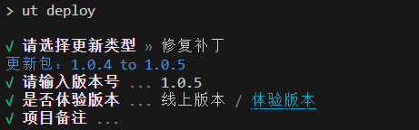

## miniprogram-ci tools

小程序miniprogram-ci cli工具，简化发布流程，直接通过cli脚本即可发布代码

## 使用说明

### 第一步 小程序后台配置
先按照官网文档下载代码上传密钥，并配置 IP 白名单[miniprogram-ci](https://developers.weixin.qq.com/miniprogram/dev/devtools/ci.html#%E6%A6%82%E8%BF%B0)

把秘钥文件【private.[appid].key】放入项目根目录即可

### 第二步 安装包

```bash
## npm
npm install @uniapp-tools/cli

## or yarn
yarn add @uniapp-tools/cli

# or pnpm
pnpm add @uniapp-tools/cli
```

### 执行cli
--path 是项目dist目录，默认位项目根目录
```bash
# uniapp project
ut deploy -p dist/dev/mp-weixin

# miniprogram project
ut deploy
```

### 根据提示上传文件到小程序
